Secure inter-micro-service communication with Spring Boot, Kafka and Vault.
===========================================================================

By Azrul MADISA

October 2020

 

Introduction
------------

Micro-services is a design pattern where large monolithic applications are
segregated into smaller, more manageable components. These components can work
together to solve a particular business problem.

 

For that, the components need to talk to each other. Communication between
components could be achieved through many ways: RESTful web services, SOAP web
services, RPC, messaging, etc. One popular implementation of messaging (publish
/ subscribe) is through Kafka.

 

>   In comparison to most messaging systems Kafka has better throughput,
>   built-in partitioning, replication, and fault-tolerance which makes it a
>   good solution for large scale message processing applications.

\<- https://kafka.apache.org/\>

 

### Publish subscribe

Kafka follows the publish subscribe pattern. This pattern works like a bulletin
board. If Alice put up an announcement on a bulletin board. Bob and Charles
could both read them. They could read them at the same time, or one after the
other. Bob could read the board today and Charles could read it tomorrow. The
announcement by Alice would remain on the bulletin board until the expiration
date for it elapsed.

 

In a messaging system, we would have publisher (Alice) and subscribers (Bob and
Charles). The bulletin board is called a Topic and the announcement is called an
Event or a Message.

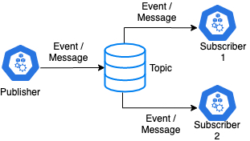

As you can see, a Topic would need to retain data for a prescribed time period.
Because of this, there is a need for the data in Topic to be secured.
Unfortunately Kafka does not handle encryption data at rest. This is where Vault
comes in.

 

### Vault

Vault provides encryption as a service for us. This allows us to have and end to
end encryption scheme for our messages. Now, of course, all we need to encrypt a
message coming from a client to a server is a private key/public key
infra-structure. It is quite easy to just create these keys and embed them into
the Publisher and Subscriber services as per below:

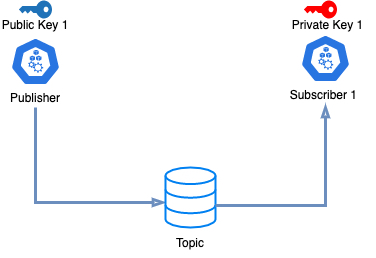

The problem is when we have multiple subscribers, each one with its own set of
private / public key. The problem would come when we need to manage the
lifecycle of the keys. When it comes to expiry for example, both keys need to be
replaced. If the keys are embedded, then redeployment may be needed.

Another problem is when keys need to be adhoc-ly revoked and replaced. There is
no easy way to do it with embedded keys.

The problem becomes more exaggerated in micro-services environment where
different services have different sets of keys - for example the service mesh
below:

 

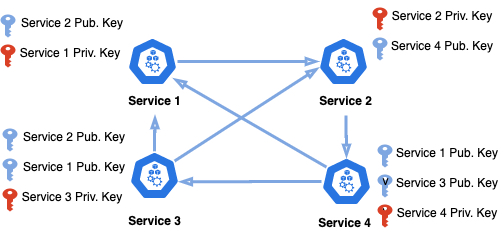

Trying to manage or revoke keys within a merely 4 services mesh is going to be
next to impossible.

 

Vault allow us to centrally manage all these keys:

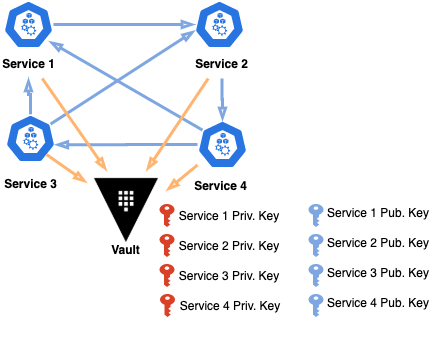

In addition, Vault allows to dynamically assign which service has access to
which key. If ever, a particular service is compromised, keys could easily be
revoked and restored if needed.

 

### Architecture

The architecture supporting secure end to end communication using Kafka is
presented below:

 

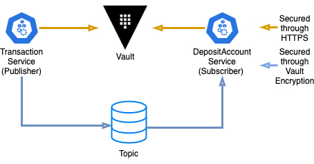

Application flow:

1.  A Transaction service would initiate a transfer of money from one Deposit
    Account to another.

2.  The Transaction Message is created and encrypted by Vault.

3.  The encrypted Transaction Message is passed to the Topic

4.  The subscriber will consumer the Message and enact the Transaction -
    transferring money from one account to another.

5.  The subscriber will then replay back to the Transaction service with the
    resulting balance

 

Security architecture

-   One very important aspect of security is to minimise the blast radius of a
    potential incident. Basically, each service should only have just enough
    access rights for it to fulfil its function - but no more than that.

-   In our setup, it is clear that Transaction Service only needs the right to
    encrypt data and DepositAccount Service only needs the right to decrypt
    data.

-   We can easily control such access rights in Vault using Policies attached to
    Vault’s access token.

-   This way, in case, say, Transaction Service is compromise, the attacker
    cannot use the Vault key possessed by Transaction Service to decrypt Kafka
    Topic’s data since the Transaction Service only has access to encrypt data,
    but not decrypt it.

 

Requirements
------------

### Directory structure

-   The directory structure we will be using is as below:

    \$PROJECTS

    —\|—DepositAccount

    —\|—GatewayKafka

    —\|—Transaction

    —\|—Registry

    —\|—k8s

    —\|—kafkatools

 

### Software

-   These are software needed to get started

    -   Java

    -   OpenSSL

 

Setting up Kubernetes and Helm
------------------------------

-   For this tutorial, we will be using Docker Desktop and its Kubernetes
    engine.

-   Follow the steps in this tutorial [Install Docker Desktop] :
    <https://github.com/azrulhasni/Ebanking-JHipster-Keycloak-Nginx-K8#install-docker-desktop>

-   Also install Helm
    <https://github.com/azrulhasni/Ebanking-JHipster-Keycloak-Nginx-K8#installing-helm>

 

Setting up Kafka
----------------

-   We will be running Kafka in our Kubernetes cluster. We will be using Helm
    for that. That being said, we will still need to download Kafka distribution
    separately because we need to use the tools that comes with Kafka.

 

### Install Kafka using Helm

-   Firstly, run the two command line below. This will install Kafka to your
    Kubernetes cluster using Helm

~~~~~~~~~~~~~~~~~~~~~~~~~~~~~~~~~~~~~~~~~~~~~~~~~~~~~~~~~~~~~~~~~~~~~~~~~~~~~~~~
> helm repo add bitnami https://charts.bitnami.com/bitnami

> helm install kafka bitnami/kafka
~~~~~~~~~~~~~~~~~~~~~~~~~~~~~~~~~~~~~~~~~~~~~~~~~~~~~~~~~~~~~~~~~~~~~~~~~~~~~~~~

-   Once done, you will get the message below:

~~~~~~~~~~~~~~~~~~~~~~~~~~~~~~~~~~~~~~~~~~~~~~~~~~~~~~~~~~~~~~~~~~~~~~~~~~~~~~~~
NAME: kafka
LAST DEPLOYED: Mon Sep 14 09:08:13 2020
NAMESPACE: default
STATUS: deployed
REVISION: 1
TEST SUITE: None
NOTES:
** Please be patient while the chart is being deployed **
Kafka can be accessed by consumers via port 9092 on the following DNS name from within your cluster:
    kafka.default.svc.cluster.local
Each Kafka broker can be accessed by producers via port 9092 on the following DNS name(s) from within your cluster:
    kafka-0.kafka-headless.default.svc.cluster.local:9092
To create a pod that you can use as a Kafka client run the following commands:
    kubectl run kafka-client --restart='Never' --image docker.io/bitnami/kafka:2.6.0-debian-10-r18 --namespace default --command -- sleep infinity
    kubectl exec --tty -i kafka-client --namespace default -- bash
    PRODUCER:
        kafka-console-producer.sh \
            --broker-list kafka-0.kafka-headless.default.svc.cluster.local:9092 \
            --topic test
    CONSUMER:
        kafka-console-consumer.sh \
            --bootstrap-server kafka.default.svc.cluster.local:9092 \
            --topic test \
            --from-beginning
~~~~~~~~~~~~~~~~~~~~~~~~~~~~~~~~~~~~~~~~~~~~~~~~~~~~~~~~~~~~~~~~~~~~~~~~~~~~~~~~

-   To double check, run:

~~~~~~~~~~~~~~~~~~~~~~~~~~~~~~~~~~~~~~~~~~~~~~~~~~~~~~~~~~~~~~~~~~~~~~~~~~~~~~~~
> kubectl get pods
~~~~~~~~~~~~~~~~~~~~~~~~~~~~~~~~~~~~~~~~~~~~~~~~~~~~~~~~~~~~~~~~~~~~~~~~~~~~~~~~

-   You should get the result below. We should see the Kafka and ZooKeeper pods
    in Running Status

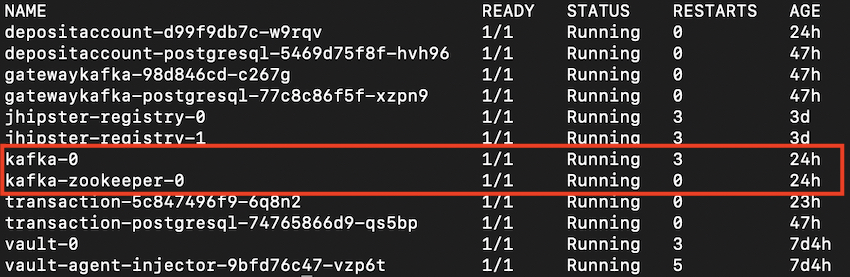

 

### Expose Kafka in Kubernetes for us to manage

-   Kafka is now successfully running. In order for us to manage it (e.g.
    creating new topics), we need to expose it temporarily to the outside world

-   Run the command below. This will expose Kafka to localhost at port 9092.

~~~~~~~~~~~~~~~~~~~~~~~~~~~~~~~~~~~~~~~~~~~~~~~~~~~~~~~~~~~~~~~~~~~~~~~~~~~~~~~~
> kubectl port-forward kafka-0 9092:9092
~~~~~~~~~~~~~~~~~~~~~~~~~~~~~~~~~~~~~~~~~~~~~~~~~~~~~~~~~~~~~~~~~~~~~~~~~~~~~~~~

 

### Installing Kafdrop

-   Kafdrop is a management tool for Kafka. We can use it to manage our Kafka
    cluster

-   Download the jar file from
    <https://github.com/obsidiandynamics/kafdrop/releases> and place it in
    the\$PROJECTS/KafkaTools folder

-   Run the command below. Make sure you replace the \<version\> with the
    version number of Kafdrop you downloaded. Note that the property
    —kafka.brokerConnect is pointing to the port we exposed in the paragraph
    above (localhost:9092) :

~~~~~~~~~~~~~~~~~~~~~~~~~~~~~~~~~~~~~~~~~~~~~~~~~~~~~~~~~~~~~~~~~~~~~~~~~~~~~~~~
> java -jar kafdrop-<version>.jar --kafka.brokerConnect=localhost:9092
~~~~~~~~~~~~~~~~~~~~~~~~~~~~~~~~~~~~~~~~~~~~~~~~~~~~~~~~~~~~~~~~~~~~~~~~~~~~~~~~

-   Then point your browser to <http://localhost:9000> . You should see the page
    below:

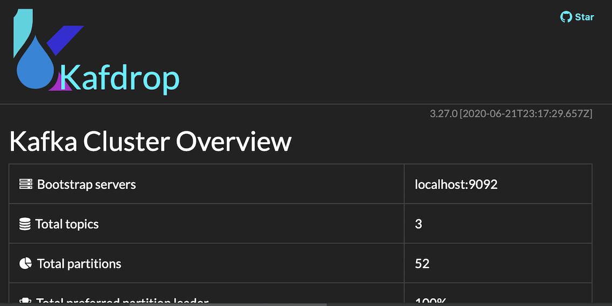

-   Navigate to the bottom of the page and find the Topic section. Click on the
    (+) button

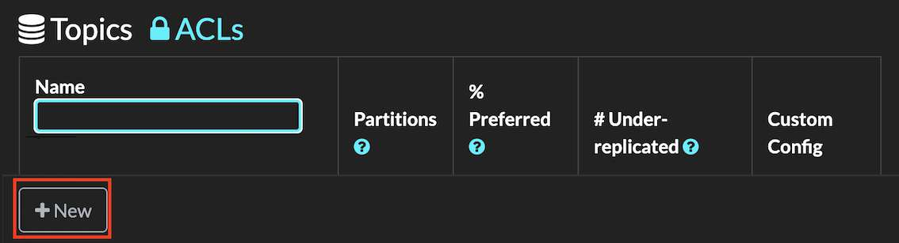

-   You will get the page below where you can create your topics.

-   Create 2 topics: `deposit-debit-response` and `deposit-debit-request`

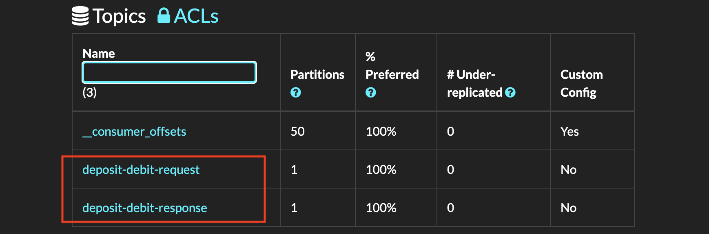

-   Go back to the command line console where the port-forward command was run,
    hit Ctrl+C in there to close that external connectivity. Alternatively, you
    can just shit down the command line console window.

-   Congratulations! We have managed to run Kafka and created 2 topics in there.

 

Setting up Vault
----------------

-   If we recall our architecture, we said that we will provide end to end
    encryption. While Vault will secure our message, who is securing Vault? -
    For that we will use a classic TLS connectivity (HTTPS) to secure our
    communication with Vault. We will create a self-signed certificate for this.

-    

### Install with TLS

-   The following steps are taken mainly from the tutorial
    below:<https://www.vaultproject.io/docs/platform/k8s/helm/examples/standalone-tls>

-   Before we start, lets validate that you have OpenSSL. Fire up your Command
    Line Console and run the commands below

~~~~~~~~~~~~~~~~~~~~~~~~~~~~~~~~~~~~~~~~~~~~~~~~~~~~~~~~~~~~~~~~~~~~~~~~~~~~~~~~
> openssl version
~~~~~~~~~~~~~~~~~~~~~~~~~~~~~~~~~~~~~~~~~~~~~~~~~~~~~~~~~~~~~~~~~~~~~~~~~~~~~~~~

-   You should get the response below (or similar) if you have openssl. If you
    do not have OpenSSL, please download it from here
    [<https://www.openssl.org/>] and install

~~~~~~~~~~~~~~~~~~~~~~~~~~~~~~~~~~~~~~~~~~~~~~~~~~~~~~~~~~~~~~~~~~~~~~~~~~~~~~~~
LibreSSL 2.6.5
~~~~~~~~~~~~~~~~~~~~~~~~~~~~~~~~~~~~~~~~~~~~~~~~~~~~~~~~~~~~~~~~~~~~~~~~~~~~~~~~

-   Next, run the command below to set up environment variables for our setup

~~~~~~~~~~~~~~~~~~~~~~~~~~~~~~~~~~~~~~~~~~~~~~~~~~~~~~~~~~~~~~~~~~~~~~~~~~~~~~~~
> SERVICE=vault
> NAMESPACE=default
> SECRET_NAME=vault-server-tls
> TMPDIR=/tmp
~~~~~~~~~~~~~~~~~~~~~~~~~~~~~~~~~~~~~~~~~~~~~~~~~~~~~~~~~~~~~~~~~~~~~~~~~~~~~~~~

SERVICE: contains vault’s service name

NAMESPACE: the Kubernetes namespace where vault is running

SECRET_NAME: the Kubernetes secret that contains the TLS certificate

TMPDIR: the temporary working directory

 

-   Then, create a key to be used for signing

~~~~~~~~~~~~~~~~~~~~~~~~~~~~~~~~~~~~~~~~~~~~~~~~~~~~~~~~~~~~~~~~~~~~~~~~~~~~~~~~
> openssl genrsa -out ${TMPDIR}/vault.key 2048
~~~~~~~~~~~~~~~~~~~~~~~~~~~~~~~~~~~~~~~~~~~~~~~~~~~~~~~~~~~~~~~~~~~~~~~~~~~~~~~~

 

-   We will now create a Certificate Signing Request (CSR). First, lets create a
    CSR configuration file:

~~~~~~~~~~~~~~~~~~~~~~~~~~~~~~~~~~~~~~~~~~~~~~~~~~~~~~~~~~~~~~~~~~~~~~~~~~~~~~~~
> cat <<EOF >${TMPDIR}/csr.conf
[req]
req_extensions = v3_req
distinguished_name = req_distinguished_name
[req_distinguished_name]
[ v3_req ]
basicConstraints = CA:FALSE
keyUsage = nonRepudiation, digitalSignature, keyEncipherment
extendedKeyUsage = serverAuth
subjectAltName = @alt_names
[alt_names]
DNS.1 = ${SERVICE}
DNS.2 = ${SERVICE}.${NAMESPACE}
DNS.3 = ${SERVICE}.${NAMESPACE}.svc
DNS.4 = ${SERVICE}.${NAMESPACE}.svc.cluster.local
IP.1 = 127.0.0.1
EOF
~~~~~~~~~~~~~~~~~~~~~~~~~~~~~~~~~~~~~~~~~~~~~~~~~~~~~~~~~~~~~~~~~~~~~~~~~~~~~~~~

Then, we will create the CSR file itself

~~~~~~~~~~~~~~~~~~~~~~~~~~~~~~~~~~~~~~~~~~~~~~~~~~~~~~~~~~~~~~~~~~~~~~~~~~~~~~~~
> openssl req -new -key ${TMPDIR}/vault.key -subj "/CN=${SERVICE}.${NAMESPACE}.svc" -out ${TMPDIR}/server.csr -config ${TMPDIR}/csr.conf
~~~~~~~~~~~~~~~~~~~~~~~~~~~~~~~~~~~~~~~~~~~~~~~~~~~~~~~~~~~~~~~~~~~~~~~~~~~~~~~~

 

-   Now, we will create the actual certificate. From the command line run

~~~~~~~~~~~~~~~~~~~~~~~~~~~~~~~~~~~~~~~~~~~~~~~~~~~~~~~~~~~~~~~~~~~~~~~~~~~~~~~~
> export CSR_NAME=vault-csr
~~~~~~~~~~~~~~~~~~~~~~~~~~~~~~~~~~~~~~~~~~~~~~~~~~~~~~~~~~~~~~~~~~~~~~~~~~~~~~~~

We will then create a csr.yaml file

~~~~~~~~~~~~~~~~~~~~~~~~~~~~~~~~~~~~~~~~~~~~~~~~~~~~~~~~~~~~~~~~~~~~~~~~~~~~~~~~
> cat <<EOF >${TMPDIR}/csr.yaml
apiVersion: certificates.k8s.io/v1beta1
kind: CertificateSigningRequest
metadata:
  name: ${CSR_NAME}
spec:
  groups:
  - system:authenticated
  request: $(cat ${TMPDIR}/server.csr | base64 | tr -d '\n')
  usages:
  - digital signature
  - key encipherment
  - server auth
EOF
~~~~~~~~~~~~~~~~~~~~~~~~~~~~~~~~~~~~~~~~~~~~~~~~~~~~~~~~~~~~~~~~~~~~~~~~~~~~~~~~

We will then create a certificate signing request in Kubernetes

~~~~~~~~~~~~~~~~~~~~~~~~~~~~~~~~~~~~~~~~~~~~~~~~~~~~~~~~~~~~~~~~~~~~~~~~~~~~~~~~
> kubectl create -f ${TMPDIR}/csr.yaml
~~~~~~~~~~~~~~~~~~~~~~~~~~~~~~~~~~~~~~~~~~~~~~~~~~~~~~~~~~~~~~~~~~~~~~~~~~~~~~~~

To verify if the certificate signing request is created, run the command below.

~~~~~~~~~~~~~~~~~~~~~~~~~~~~~~~~~~~~~~~~~~~~~~~~~~~~~~~~~~~~~~~~~~~~~~~~~~~~~~~~
> kubectl get csr ${CSR_NAME}
~~~~~~~~~~~~~~~~~~~~~~~~~~~~~~~~~~~~~~~~~~~~~~~~~~~~~~~~~~~~~~~~~~~~~~~~~~~~~~~~

Then, approve the CSR. By this command, you have signed the CSR

~~~~~~~~~~~~~~~~~~~~~~~~~~~~~~~~~~~~~~~~~~~~~~~~~~~~~~~~~~~~~~~~~~~~~~~~~~~~~~~~
> kubectl certificate approve ${CSR_NAME}
~~~~~~~~~~~~~~~~~~~~~~~~~~~~~~~~~~~~~~~~~~~~~~~~~~~~~~~~~~~~~~~~~~~~~~~~~~~~~~~~

After that, export the certificate out to a file called vault.crt

~~~~~~~~~~~~~~~~~~~~~~~~~~~~~~~~~~~~~~~~~~~~~~~~~~~~~~~~~~~~~~~~~~~~~~~~~~~~~~~~
> serverCert=$(kubectl get csr ${CSR_NAME} -o jsonpath='{.status.certificate}')
> echo "${serverCert}" | openssl base64 -d -A -out ${TMPDIR}/vault.crt
~~~~~~~~~~~~~~~~~~~~~~~~~~~~~~~~~~~~~~~~~~~~~~~~~~~~~~~~~~~~~~~~~~~~~~~~~~~~~~~~

Also export out Kubernetes CA

~~~~~~~~~~~~~~~~~~~~~~~~~~~~~~~~~~~~~~~~~~~~~~~~~~~~~~~~~~~~~~~~~~~~~~~~~~~~~~~~
> kubectl config view --raw --minify --flatten -o jsonpath='{.clusters[].cluster.certificate-authority-data}' | base64 -d > ${TMPDIR}/vault.ca
~~~~~~~~~~~~~~~~~~~~~~~~~~~~~~~~~~~~~~~~~~~~~~~~~~~~~~~~~~~~~~~~~~~~~~~~~~~~~~~~

Create a secret storing all the files created above

~~~~~~~~~~~~~~~~~~~~~~~~~~~~~~~~~~~~~~~~~~~~~~~~~~~~~~~~~~~~~~~~~~~~~~~~~~~~~~~~
> kubectl create secret generic ${SECRET_NAME} --namespace ${NAMESPACE} --from-file=vault.key=${TMPDIR}/vault.key --from-file=vault.crt=${TMPDIR}/vault.crt --from-file=vault.ca=${TMPDIR}/vault.ca
~~~~~~~~~~~~~~~~~~~~~~~~~~~~~~~~~~~~~~~~~~~~~~~~~~~~~~~~~~~~~~~~~~~~~~~~~~~~~~~~

 

-   We will next create a file called custom-values.yaml in the \$PROJECTS/k8s
    folder. The content of the file should be:

~~~~~~~~~~~~~~~~~~~~~~~~~~~~~~~~~~~~~~~~~~~~~~~~~~~~~~~~~~~~~~~~~~~~~~~~~~~~~~~~
global:
  enabled: true
  tlsDisable: false
server:
  extraEnvironmentVars:
    VAULT_CACERT: /vault/userconfig/vault-server-tls/vault.ca
  extraVolumes:
    - type: secret
      name: vault-server-tls
  standalone:
    enabled: true
    config: |
      listener "tcp" {
        address = "[::]:8200"
        cluster_address = "[::]:8201"
        tls_cert_file = "/vault/userconfig/vault-server-tls/vault.crt"
        tls_key_file  = "/vault/userconfig/vault-server-tls/vault.key"
        tls_client_ca_file = "/vault/userconfig/vault-server-tls/vault.ca"
      }

      storage "file" {
        path = "/vault/data"
      }
~~~~~~~~~~~~~~~~~~~~~~~~~~~~~~~~~~~~~~~~~~~~~~~~~~~~~~~~~~~~~~~~~~~~~~~~~~~~~~~~

We will then use Helm to install a standalone Vault protected via our
self-signed SSL. Point your command line console to the folder \$PROJECTS/k8s
and run:

~~~~~~~~~~~~~~~~~~~~~~~~~~~~~~~~~~~~~~~~~~~~~~~~~~~~~~~~~~~~~~~~~~~~~~~~~~~~~~~~
> helm repo add hashicorp https://helm.releases.hashicorp.com
> helm install vault -f custom-values.yaml hashicorp/vault
~~~~~~~~~~~~~~~~~~~~~~~~~~~~~~~~~~~~~~~~~~~~~~~~~~~~~~~~~~~~~~~~~~~~~~~~~~~~~~~~

To verify that vault is running, run the command below:

~~~~~~~~~~~~~~~~~~~~~~~~~~~~~~~~~~~~~~~~~~~~~~~~~~~~~~~~~~~~~~~~~~~~~~~~~~~~~~~~
> kubectl get pods
~~~~~~~~~~~~~~~~~~~~~~~~~~~~~~~~~~~~~~~~~~~~~~~~~~~~~~~~~~~~~~~~~~~~~~~~~~~~~~~~

You should see vault in the list of pods

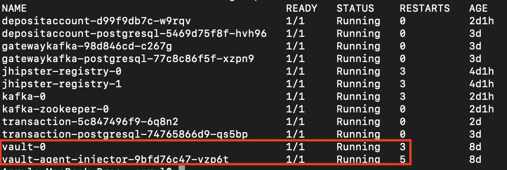

 

### Initialize Vault

-   To initialize vault, we need to run the command below:

~~~~~~~~~~~~~~~~~~~~~~~~~~~~~~~~~~~~~~~~~~~~~~~~~~~~~~~~~~~~~~~~~~~~~~~~~~~~~~~~
> kubectl exec -ti vault-0 -- vault operator init -format=json > cluster-keys.json
~~~~~~~~~~~~~~~~~~~~~~~~~~~~~~~~~~~~~~~~~~~~~~~~~~~~~~~~~~~~~~~~~~~~~~~~~~~~~~~~

-   This will create a json file with 5 keys. The content of the json file could
    look like below:

~~~~~~~~~~~~~~~~~~~~~~~~~~~~~~~~~~~~~~~~~~~~~~~~~~~~~~~~~~~~~~~~~~~~~~~~~~~~~~~~
{
  "keys": [
    "dea...94",
    "0c0...10",
    "800...29",
    "88e...1e",
    "5by...8z"
  ],
  "keys_base64": [
    "...",
    "...",
    "...",
    "...",
    "..."
  ],
  "root_token": "s.Tyu...d"
}
~~~~~~~~~~~~~~~~~~~~~~~~~~~~~~~~~~~~~~~~~~~~~~~~~~~~~~~~~~~~~~~~~~~~~~~~~~~~~~~~

 

### Unseal Vault

-   When Vault is initialised, it is running in a sealed mode. We need to unseal
    it for Vault to be useful.

-   You will also need to unseal Vault everytime it is restarted

-   In the step above (Initialize Vault), we have created a son file with 5
    keys. We need to provide 3 of the keys to unseal Vault. To unseal, run the
    command below:

~~~~~~~~~~~~~~~~~~~~~~~~~~~~~~~~~~~~~~~~~~~~~~~~~~~~~~~~~~~~~~~~~~~~~~~~~~~~~~~~
> kubectl exec -ti vault-0 -- vault operator unseal 
~~~~~~~~~~~~~~~~~~~~~~~~~~~~~~~~~~~~~~~~~~~~~~~~~~~~~~~~~~~~~~~~~~~~~~~~~~~~~~~~

-   This command will prompt for the key. Key in one of the key and hit enter.

-   You will get the result below:

~~~~~~~~~~~~~~~~~~~~~~~~~~~~~~~~~~~~~~~~~~~~~~~~~~~~~~~~~~~~~~~~~~~~~~~~~~~~~~~~
Key             Value
---             -----
Seal Type       shamir
Initialized     true
Sealed          false
Total Shares    5
Threshold       3
Version         1.5.2
Cluster Name    vault-cluster-e4b6a573
Cluster ID      80...b
HA Enabled      false
~~~~~~~~~~~~~~~~~~~~~~~~~~~~~~~~~~~~~~~~~~~~~~~~~~~~~~~~~~~~~~~~~~~~~~~~~~~~~~~~

-   Rerun the command above 2 more times with different key each time

-   Congratulation. You have unseal Vault.

 

### Exposing Vault web ui

-   Next we will expose Vault to the world outside of Kubernetes using the
    port-forward command he used before with Kafka. Note that, with Vault, we
    are exposing the service through port-forward, not the pod.

~~~~~~~~~~~~~~~~~~~~~~~~~~~~~~~~~~~~~~~~~~~~~~~~~~~~~~~~~~~~~~~~~~~~~~~~~~~~~~~~
> kubectl port-forward service/vault 8200:8200
~~~~~~~~~~~~~~~~~~~~~~~~~~~~~~~~~~~~~~~~~~~~~~~~~~~~~~~~~~~~~~~~~~~~~~~~~~~~~~~~

 

### Creating the transit engine

-   Vault Transit engine is an encryption-as-a-service facility provided by
    Vault. We will use this to encrypt our messages.

-   Point your browser to the address https://localhost:8200 (notice that it is
    http**s**). Chances are, you will get a dialog where you need to accept the
    self-signed certificate. Click OK.

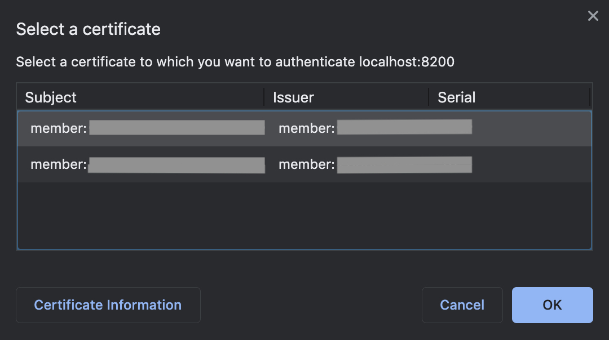

-   You will then see the page below. In the Token field, key in the
    `root_token` value from the cluster-key.json file created during
    initialisation just now.

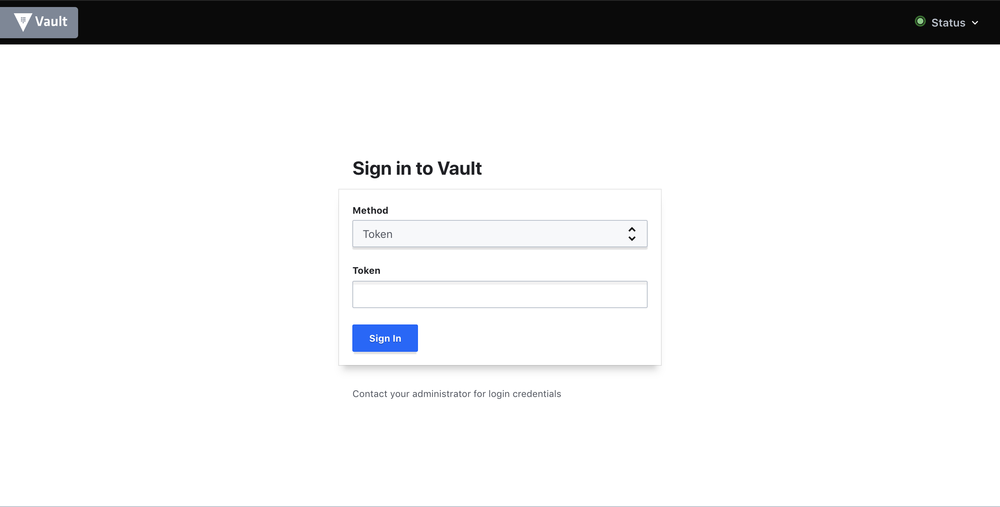

-   Then, click on Enable new engine

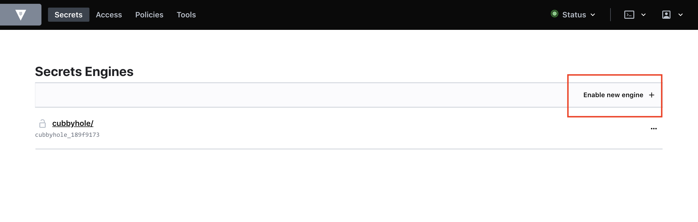

-   Choose Transit, and click Next

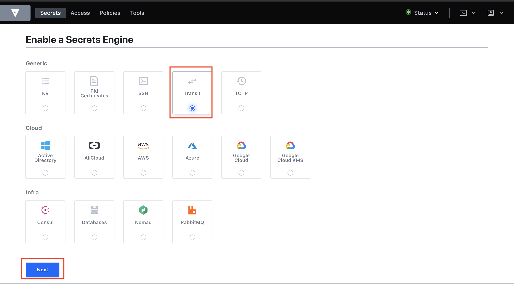

-   Then, key in ’transit’ in the Path field, and click on Enable Engine

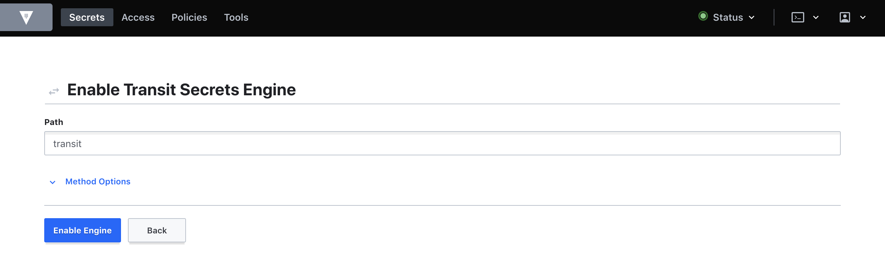

-   You will get the transit engine listed in your secret

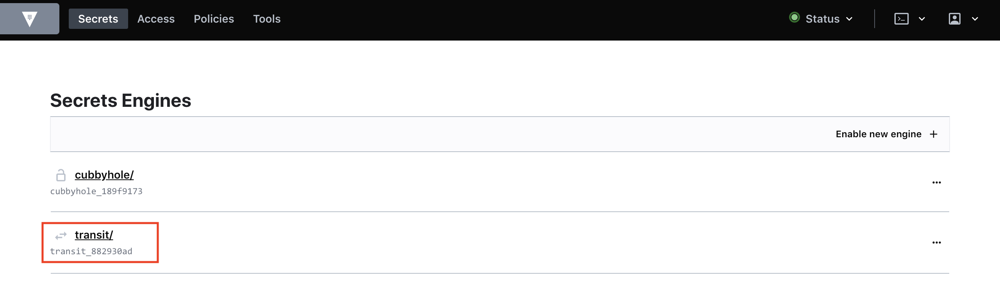

-   On the transit page, click on ‘Create encryption key'

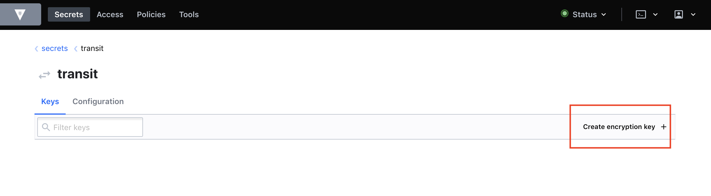

-   In the ‘Create encryption key’ page, put in my-encryption-key in the Name
    field and click on Create Encryption Key

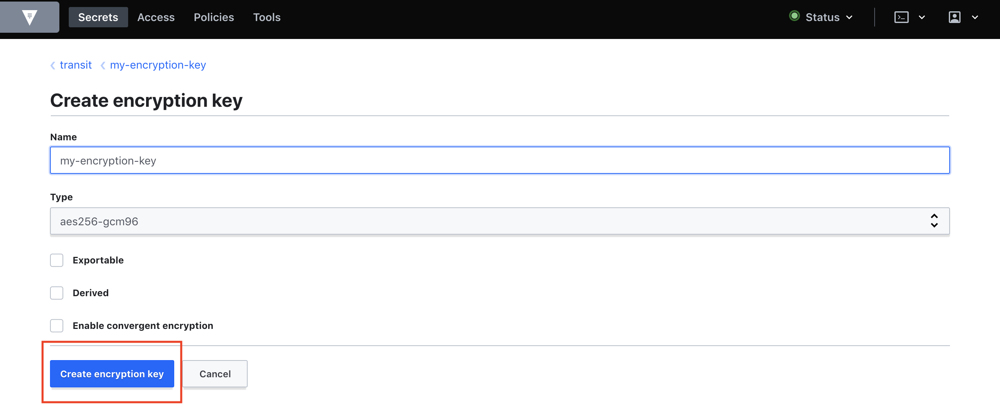

-   You will see the encryption key is created

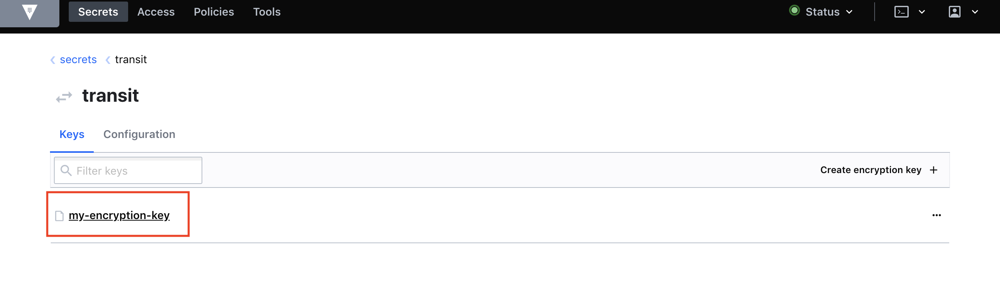

-   Congratulation. You created a Transit engine

 

### Manage access and policy

-   Click on the menu Policies. Then click on ‘Create ACL policy'

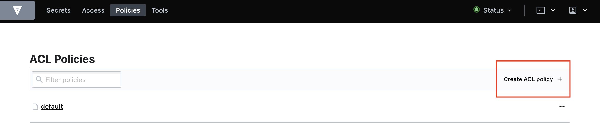

-   In Name, put in my-encrypt-policy. In policy put in the code below. This
    will allow this policy to only encrypt data below. Once done, click on
    'Create Policy':

~~~~~~~~~~~~~~~~~~~~~~~~~~~~~~~~~~~~~~~~~~~~~~~~~~~~~~~~~~~~~~~~~~~~~~~~~~~~~~~~
path "transit/decrypt/my-encryption-key" {
  capabilities = [ "update" ]
}
~~~~~~~~~~~~~~~~~~~~~~~~~~~~~~~~~~~~~~~~~~~~~~~~~~~~~~~~~~~~~~~~~~~~~~~~~~~~~~~~

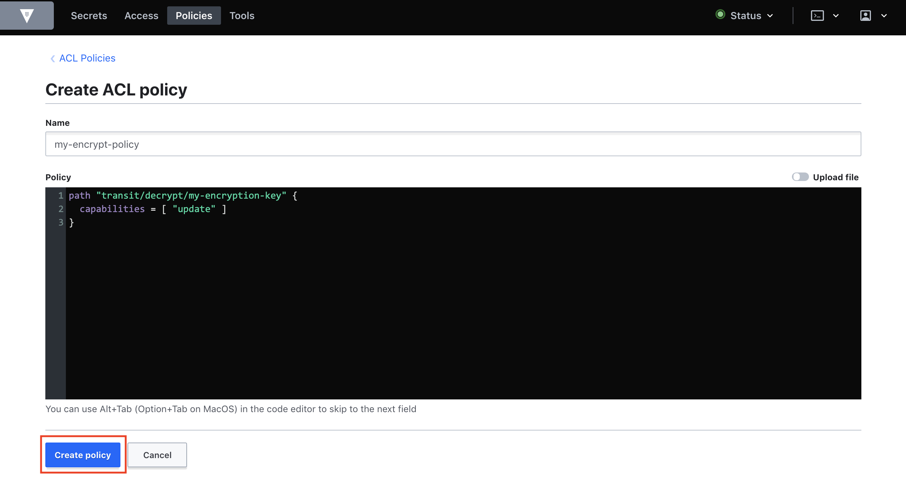

-   Click on the Policies \> Create ACL Policy once more. In Name, put in
    ‘my-encrypy-policy’ and in Policy put the code below. Then click on ‘Create
    Policy'

~~~~~~~~~~~~~~~~~~~~~~~~~~~~~~~~~~~~~~~~~~~~~~~~~~~~~~~~~~~~~~~~~~~~~~~~~~~~~~~~
path "transit/encrypt/my-encryption-key" {
  capabilities = [ "update" ]
}
~~~~~~~~~~~~~~~~~~~~~~~~~~~~~~~~~~~~~~~~~~~~~~~~~~~~~~~~~~~~~~~~~~~~~~~~~~~~~~~~

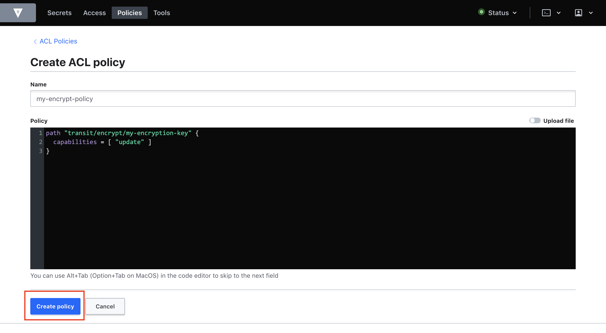

-   You should have 2 policies now set up:

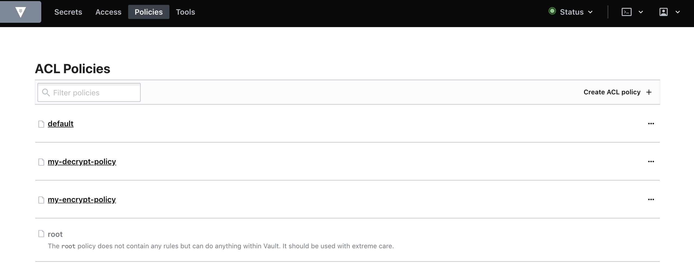

-   Then fire up your command line console and run the curl command below. Note
    that the value `s.Tyu…d `below is the value of the root token obtained from
    the file cluster-keys.json above. The value of the policy we created,
    my-encrypt-policy, is also specified below. (We use the option -k on our
    curl command because the certificate we use is self-signed. Without -k, the
    curl command will complain about our certificate)

~~~~~~~~~~~~~~~~~~~~~~~~~~~~~~~~~~~~~~~~~~~~~~~~~~~~~~~~~~~~~~~~~~~~~~~~~~~~~~~~
> curl --header "X-Vault-Token: s.Tyu...d" --request POST --data '{"policies": ["my-encrypt-policy"]}' -k https://localhost:8200/v1/auth/token/create
~~~~~~~~~~~~~~~~~~~~~~~~~~~~~~~~~~~~~~~~~~~~~~~~~~~~~~~~~~~~~~~~~~~~~~~~~~~~~~~~

You should get the response below. Note the value` s.O1...k` of the client
token. Let us call this the **encryptor-token**

~~~~~~~~~~~~~~~~~~~~~~~~~~~~~~~~~~~~~~~~~~~~~~~~~~~~~~~~~~~~~~~~~~~~~~~~~~~~~~~~
{
   "request_id":"d5b47829-53f0-a35e-4b7c-0e9d8f4f3cbc",
   "lease_id":"",
   "renewable":false,
   "lease_duration":0,
   "data":null,
   "wrap_info":null,
   "warnings":null,
   "auth":{
      "client_token":"s.O1sI3QhVvSmbG1lyfKSMXXFk",
      "accessor":"T...8",
      "policies":[
         "default",
         "my-encrypt-policy"
      ],
      "token_policies":[
         "default",
         "my-encrypt-policy"
      ],
      "metadata":null,
      "lease_duration":2764800,
      "renewable":true,
      "entity_id":"",
      "token_type":"service",
      "orphan":false
   }
}
~~~~~~~~~~~~~~~~~~~~~~~~~~~~~~~~~~~~~~~~~~~~~~~~~~~~~~~~~~~~~~~~~~~~~~~~~~~~~~~~

 

-   Let us repeat the same curl command, this time around, we will use the
    my-decrypt-policy policy

~~~~~~~~~~~~~~~~~~~~~~~~~~~~~~~~~~~~~~~~~~~~~~~~~~~~~~~~~~~~~~~~~~~~~~~~~~~~~~~~
curl --header "X-Vault-Token: s.WuTNTDpBqsspinc6dlDN0cbz" --request POST --data '{"policies": ["my-decrypt-policy"]}' -k https://localhost:8200/v1/auth/token/create
~~~~~~~~~~~~~~~~~~~~~~~~~~~~~~~~~~~~~~~~~~~~~~~~~~~~~~~~~~~~~~~~~~~~~~~~~~~~~~~~

We should see the result below. Note the client token (`s.7x…Xv`). We will call
this token as the **decryptor-token**

~~~~~~~~~~~~~~~~~~~~~~~~~~~~~~~~~~~~~~~~~~~~~~~~~~~~~~~~~~~~~~~~~~~~~~~~~~~~~~~~
{
   "request_id":"d5b47829-53f0-a35e-4b7c-0e9d8f4f3cbc",
   "lease_id":"",
   "renewable":false,
   "lease_duration":0,
   "data":null,
   "wrap_info":null,
   "warnings":null,
   "auth":{
      "client_token":"s.7xdIhRPcJXFw2B1s6fKasHXv",
      "accessor":"TSNoAMVNwFEUzlmx8tjRh9w8",
      "policies":[
         "default",
         "my-encrypt-policy"
      ],
      "token_policies":[
         "default",
         "my-encrypt-policy"
      ],
      "metadata":null,
      "lease_duration":2764800,
      "renewable":true,
      "entity_id":"",
      "token_type":"service",
      "orphan":false
   }
~~~~~~~~~~~~~~~~~~~~~~~~~~~~~~~~~~~~~~~~~~~~~~~~~~~~~~~~~~~~~~~~~~~~~~~~~~~~~~~~

 

### Testing Vault’s encryption as a service

-   So let us test drive our setup. First, we need a base-64 string. Open up
    your command line console and run the command below. You can use other than
    ‘Hello world’ of course.

~~~~~~~~~~~~~~~~~~~~~~~~~~~~~~~~~~~~~~~~~~~~~~~~~~~~~~~~~~~~~~~~~~~~~~~~~~~~~~~~
> echo -n 'Hello world'|openssl base64
~~~~~~~~~~~~~~~~~~~~~~~~~~~~~~~~~~~~~~~~~~~~~~~~~~~~~~~~~~~~~~~~~~~~~~~~~~~~~~~~

-   You will get

~~~~~~~~~~~~~~~~~~~~~~~~~~~~~~~~~~~~~~~~~~~~~~~~~~~~~~~~~~~~~~~~~~~~~~~~~~~~~~~~
SGVsbG8gd29ybGQ=
~~~~~~~~~~~~~~~~~~~~~~~~~~~~~~~~~~~~~~~~~~~~~~~~~~~~~~~~~~~~~~~~~~~~~~~~~~~~~~~~

-   Let us encrypt that string using the encryptor token.

~~~~~~~~~~~~~~~~~~~~~~~~~~~~~~~~~~~~~~~~~~~~~~~~~~~~~~~~~~~~~~~~~~~~~~~~~~~~~~~~
> curl --header "X-Vault-Token: s.O1sI3QhVvSmbG1lyfKSMXXFk" --request POST --data '{"plaintext": "SGVsbG8gd29ybGQ="}' -k https://127.0.0.1:8200/v1/transit/encrypt/my-encryption-key
~~~~~~~~~~~~~~~~~~~~~~~~~~~~~~~~~~~~~~~~~~~~~~~~~~~~~~~~~~~~~~~~~~~~~~~~~~~~~~~~

-   You will get the response below. The encrypted data is in the field cipher
    text.

~~~~~~~~~~~~~~~~~~~~~~~~~~~~~~~~~~~~~~~~~~~~~~~~~~~~~~~~~~~~~~~~~~~~~~~~~~~~~~~~
{
   "request_id":"c345db50-2517-90de-cc8c-f66812b27d6b",
   "lease_id":"",
   "renewable":false,
   "lease_duration":0,
   "data":{
      "ciphertext":"vault:v1:+VZG+5sZA0AQworFh5+o/kTyri6I+ooKWjfwbVOtB+lY/AWRurhO",
      "key_version":1
   },
   "wrap_info":null,
   "warnings":null,
 }
~~~~~~~~~~~~~~~~~~~~~~~~~~~~~~~~~~~~~~~~~~~~~~~~~~~~~~~~~~~~~~~~~~~~~~~~~~~~~~~~

-   Now, lets try decrypting, with the decryptor token. Note that the field
    ciphertext contains encrypted data above

~~~~~~~~~~~~~~~~~~~~~~~~~~~~~~~~~~~~~~~~~~~~~~~~~~~~~~~~~~~~~~~~~~~~~~~~~~~~~~~~
curl --header "X-Vault-Token: s.7xdIhRPcJXFw2B1s6fKasHXv" --request POST --data '{"ciphertext":"vault:v1:+VZG+5sZA0AQworFh5+o/kTyri6I+ooKWjfwbVOtB+lY/AWRurhO"}' -k https://127.0.0.1:8200/v1/transit/decrypt/my-encryption-key
~~~~~~~~~~~~~~~~~~~~~~~~~~~~~~~~~~~~~~~~~~~~~~~~~~~~~~~~~~~~~~~~~~~~~~~~~~~~~~~~

-   You will then get the response below. Notice that we get back the base 64
    string we encrypt earlier.

~~~~~~~~~~~~~~~~~~~~~~~~~~~~~~~~~~~~~~~~~~~~~~~~~~~~~~~~~~~~~~~~~~~~~~~~~~~~~~~~
{
   "request_id":"7d00a316-90ff-9c94-3e6f-d8e60b0560e3",
   "lease_id":"",
   "renewable":false,
   "lease_duration":0,
   "data":{
      "plaintext":"SGVsbG8gd29ybGQ="
   },
   "wrap_info":null,
   "warnings":null,
   "auth":null
}
~~~~~~~~~~~~~~~~~~~~~~~~~~~~~~~~~~~~~~~~~~~~~~~~~~~~~~~~~~~~~~~~~~~~~~~~~~~~~~~~

-   Now, lets try a negative test case. Lets try to encrypt data but using the
    decrypt token instead

~~~~~~~~~~~~~~~~~~~~~~~~~~~~~~~~~~~~~~~~~~~~~~~~~~~~~~~~~~~~~~~~~~~~~~~~~~~~~~~~
> curl --header "X-Vault-Token: s.7xdIhRPcJXFw2B1s6fKasHXv" --request POST --data '{"plaintext": "SGVsbG8gd29ybGQ="}' -k https://127.0.0.1:8200/v1/transit/encrypt/my-encryption-key
~~~~~~~~~~~~~~~~~~~~~~~~~~~~~~~~~~~~~~~~~~~~~~~~~~~~~~~~~~~~~~~~~~~~~~~~~~~~~~~~

-   You will end up with an error

~~~~~~~~~~~~~~~~~~~~~~~~~~~~~~~~~~~~~~~~~~~~~~~~~~~~~~~~~~~~~~~~~~~~~~~~~~~~~~~~
{"errors":["1 error occurred:\n\t* permission denied\n\n"]}
~~~~~~~~~~~~~~~~~~~~~~~~~~~~~~~~~~~~~~~~~~~~~~~~~~~~~~~~~~~~~~~~~~~~~~~~~~~~~~~~

-   You can try the reverse, trying to decrypt with using the encryptor token

~~~~~~~~~~~~~~~~~~~~~~~~~~~~~~~~~~~~~~~~~~~~~~~~~~~~~~~~~~~~~~~~~~~~~~~~~~~~~~~~
> curl --header "X-Vault-Token: s.O1sI3QhVvSmbG1lyfKSMXXFk" --request POST --data '{"ciphertext":"vault:v1:+VZG+5sZA0AQworFh5+o/kTyri6I+ooKWjfwbVOtB+lY/AWRurhO"}' -k https://127.0.0.1:8200/v1/transit/decrypt/my-encryption-key
~~~~~~~~~~~~~~~~~~~~~~~~~~~~~~~~~~~~~~~~~~~~~~~~~~~~~~~~~~~~~~~~~~~~~~~~~~~~~~~~

-   You will end up with the same error as above

~~~~~~~~~~~~~~~~~~~~~~~~~~~~~~~~~~~~~~~~~~~~~~~~~~~~~~~~~~~~~~~~~~~~~~~~~~~~~~~~
{"errors":["1 error occurred:\n\t* permission denied\n\n"]}
~~~~~~~~~~~~~~~~~~~~~~~~~~~~~~~~~~~~~~~~~~~~~~~~~~~~~~~~~~~~~~~~~~~~~~~~~~~~~~~~

 

### Conclusion for Vault

So we have finally install and setup Vault in our Kubernetes cluster (Standalone
setup). We have activated the encryption-as-a-service engine and created two
different tokens with two different capabilities. The encryptor-token to encrypt
data and the decryptor-token to decrypt data.

This fulfils our requirements stated earlier in this article where a service
would only have access to what it needs to execute its function. We can now
embed the encryptor-token into our Transaction Service and the decryptor-token
into our DepositAccount Service.

 

Creating micro services
-----------------------

-   We will be creating 2 micro services: Transaction and DepositAccount. We
    will be using JHipster for this.

-   To start we will need to install JHipster. Please follow the tutorial here
    to install JHipster [<https://www.jhipster.tech/installation/>]

 

### Setup JHipster Registry

-   Download JHipster Registry <https://www.jhipster.tech/jhipster-registry/> as
    a jar file and put in the \$PROJECTS/Registry folder

-   Create another folder: \$PROJECTS/Registry/central-config. In
    central-config, create a file called application.yml and insert the content
    below. Please make sure you replace
    `my-secret-key-which-should-be-changed-in-production-and-be-base64-encoded`
    with your own secret in production :

~~~~~~~~~~~~~~~~~~~~~~~~~~~~~~~~~~~~~~~~~~~~~~~~~~~~~~~~~~~~~~~~~~~~~~~~~~~~~~~~
# ===================================================================
# JHipster Sample Spring Cloud Config.
# ===================================================================

# Property used on app startup to check the config server status
configserver:
    name: JHipster Registry config server
    status: Connected to the JHipster Registry config server!

# Default JWT secret token (to be changed in production!)
jhipster:
    security:
        authentication:
            jwt:
                # It is recommended to encrypt the secret key in Base64, using the `base64-secret` property.
                # For compabitibily issues with applications generated with older JHipster releases,
                # we use the non Base64-encoded `secret` property here.
                secret: my-secret-key-which-should-be-changed-in-production-and-be-base64-encoded
                # The `base64-secret` property is recommended if you use JHipster v5.3.0+
                # (you can type `echo 'secret-key'|base64` on your command line)
                # base64-secret: bXktc2VjcmV0LWtleS13aGljaC1zaG91bGQtYmUtY2hhbmdlZC1pbi1wcm9kdWN0aW9uLWFuZC1iZS1iYXNlNjQtZW5jb2RlZAo=
   
# Enable /management/logfile endpoint for all apps
logging:
    path: /tmp
    file: ${spring.application.name}.log
~~~~~~~~~~~~~~~~~~~~~~~~~~~~~~~~~~~~~~~~~~~~~~~~~~~~~~~~~~~~~~~~~~~~~~~~~~~~~~~~

-   To run the registry, open a command line console, point it to
    \$PROJECTS/Registry and run:

~~~~~~~~~~~~~~~~~~~~~~~~~~~~~~~~~~~~~~~~~~~~~~~~~~~~~~~~~~~~~~~~~~~~~~~~~~~~~~~~
> java -jar jhipster-registry-6.3.0.jar --spring.security.user.password=admin --jhipster.security.authentication.jwt.secret=my-secret-key-which-should-be-changed-in-production-and-be-base64-encoded --spring.cloud.config.server.composite.0.type=native --spring.cloud.config.server.composite.0.search-locations=file:./central-config
~~~~~~~~~~~~~~~~~~~~~~~~~~~~~~~~~~~~~~~~~~~~~~~~~~~~~~~~~~~~~~~~~~~~~~~~~~~~~~~~

-   As you can see, you can override the property
    `jhipster.security.authentication.jwt.secret` directly in the start up
    script

 

### Setup the gateway

Fire up a command line console and point it to the \$PROJECTS/GatewayKafka
folder. Run:

~~~~~~~~~~~~~~~~~~~~~~~~~~~~~~~~~~~~~~~~~~~~~~~~~~~~~~~~~~~~~~~~~~~~~~~~~~~~~~~~
> jhipster
~~~~~~~~~~~~~~~~~~~~~~~~~~~~~~~~~~~~~~~~~~~~~~~~~~~~~~~~~~~~~~~~~~~~~~~~~~~~~~~~

A set of questions will be asked. Answer them as follows. Please note that when
asked Which other technologies would you like to use? DO NOT choose Kafka. We
will deal with Kafka separately and not through JHipster :

~~~~~~~~~~~~~~~~~~~~~~~~~~~~~~~~~~~~~~~~~~~~~~~~~~~~~~~~~~~~~~~~~~~~~~~~~~~~~~~~
? Which *type* of application would you like to create? Microservice gateway
? [Beta] Do you want to make it reactive with Spring WebFlux? No
? What is the base name of your application? GatewayKafka
? As you are running in a microservice architecture, on which port would like yo
ur server to run? It should be unique to avoid port conflicts. 8080
? What is your default Java package name? com.azrul.ebanking.gatewaykafka
? Which service discovery server do you want to use? JHipster Registry (uses Eur
eka, provides Spring Cloud Config support and monitoring dashboards)
? Which *type* of authentication would you like to use? JWT authentication (stat
eless, with a token)
? Which *type* of database would you like to use? SQL (H2, MySQL, MariaDB, Postg
reSQL, Oracle, MSSQL)
? Which *production* database would you like to use? PostgreSQL
? Which *development* database would you like to use? H2 with disk-based persist
ence
? Do you want to use the Spring cache abstraction? No - Warning, when using an S
QL database, this will disable the Hibernate 2nd level cache!
? Do you want to use Hibernate 2nd level cache? No
? Would you like to use Maven or Gradle for building the backend? Maven
? Which other technologies would you like to use? 
? Which *Framework* would you like to use for the client? Angular
? Would you like to use a Bootswatch theme (https://bootswatch.com/)? Default JH
ipster
? Would you like to enable internationalization support? No
? Besides JUnit and Jest, which testing frameworks would you like to use? 
? Would you like to install other generators from the JHipster Marketplace? (y/N
) No
~~~~~~~~~~~~~~~~~~~~~~~~~~~~~~~~~~~~~~~~~~~~~~~~~~~~~~~~~~~~~~~~~~~~~~~~~~~~~~~~

 

### Setup Transaction micro-service

Fire up a command line console and point it to the \$PROJECTS/Transaction
folder. Run:

~~~~~~~~~~~~~~~~~~~~~~~~~~~~~~~~~~~~~~~~~~~~~~~~~~~~~~~~~~~~~~~~~~~~~~~~~~~~~~~~
> jhipster
~~~~~~~~~~~~~~~~~~~~~~~~~~~~~~~~~~~~~~~~~~~~~~~~~~~~~~~~~~~~~~~~~~~~~~~~~~~~~~~~

A set of questions will be asked. Answer them as follows. Please note that when
asked Which other technologies would you like to use? DO NOT choose Kafka. We
will deal with Kafka separately and not through JHipster :

~~~~~~~~~~~~~~~~~~~~~~~~~~~~~~~~~~~~~~~~~~~~~~~~~~~~~~~~~~~~~~~~~~~~~~~~~~~~~~~~
? Which *type* of application would you like to create? Microservice application
? [Beta] Do you want to make it reactive with Spring WebFlux? No
? What is the base name of your application? Transaction
? As you are running in a microservice architecture, on which port would like yo
ur server to run? It should be unique to avoid port conflicts. 8081
? What is your default Java package name? com.azrul.ebanking.transaction
? Which service discovery server do you want to use? JHipster Registry (uses Eur
eka, provides Spring Cloud Config support and monitoring dashboards)
? Which *type* of authentication would you like to use? JWT authentication (stat
eless, with a token)
? Which *type* of database would you like to use? SQL (H2, MySQL, MariaDB, Postg
reSQL, Oracle, MSSQL)
? Which *production* database would you like to use? PostgreSQL
? Which *development* database would you like to use? H2 with disk-based persist
ence
? Do you want to use the Spring cache abstraction? No - Warning, when using an S
QL database, this will disable the Hibernate 2nd level cache!
? Would you like to use Maven or Gradle for building the backend? Maven
? Which other technologies would you like to use? 
? Would you like to enable internationalization support? No
? Besides JUnit and Jest, which testing frameworks would you like to use? 
? Would you like to install other generators from the JHipster Marketplace? No
~~~~~~~~~~~~~~~~~~~~~~~~~~~~~~~~~~~~~~~~~~~~~~~~~~~~~~~~~~~~~~~~~~~~~~~~~~~~~~~~

 

### Setup DepositAccount micro-service

Fire up a command line console and point it to the \$PROJECTS/DepositAccount
folder. Run:

~~~~~~~~~~~~~~~~~~~~~~~~~~~~~~~~~~~~~~~~~~~~~~~~~~~~~~~~~~~~~~~~~~~~~~~~~~~~~~~~
> jhipster
~~~~~~~~~~~~~~~~~~~~~~~~~~~~~~~~~~~~~~~~~~~~~~~~~~~~~~~~~~~~~~~~~~~~~~~~~~~~~~~~

A set of questions will be asked. Answer them as follows. Please note that when
asked Which other technologies would you like to use? DO NOT choose Kafka. We
will deal with Kafka separately and not through JHipster :

~~~~~~~~~~~~~~~~~~~~~~~~~~~~~~~~~~~~~~~~~~~~~~~~~~~~~~~~~~~~~~~~~~~~~~~~~~~~~~~~
? Which *type* of application would you like to create? Microservice application
? [Beta] Do you want to make it reactive with Spring WebFlux? No
? What is the base name of your application? DepositAccount
? As you are running in a microservice architecture, on which port would like yo
ur server to run? It should be unique to avoid port conflicts. 8082
? What is your default Java package name? com.azrul.ebanking.depositaccount
? Which service discovery server do you want to use? JHipster Registry (uses Eur
eka, provides Spring Cloud Config support and monitoring dashboards)
? Which *type* of authentication would you like to use? JWT authentication (stat
eless, with a token)
? Which *type* of database would you like to use? SQL (H2, MySQL, MariaDB, Postg
reSQL, Oracle, MSSQL)
? Which *production* database would you like to use? PostgreSQL
? Which *development* database would you like to use? H2 with disk-based persist
ence
? Do you want to use the Spring cache abstraction? No - Warning, when using an S
QL database, this will disable the Hibernate 2nd level cache!
? Would you like to use Maven or Gradle for building the backend? Maven
? Which other technologies would you like to use? 
? Would you like to enable internationalization support? No
? Besides JUnit and Jest, which testing frameworks would you like to use? 
? Would you like to install other generators from the JHipster Marketplace? (y/N
) No
~~~~~~~~~~~~~~~~~~~~~~~~~~~~~~~~~~~~~~~~~~~~~~~~~~~~~~~~~~~~~~~~~~~~~~~~~~~~~~~~

\----------------

 

 

 

 

 

Build Docker Image
------------------

 

To generate the missing Docker image(s), please run:

  ./mvnw -ntp -Pprod -Dmaven.test.skip=true verify jib:dockerBuild in
/Users/azrul/Documents/GitHub/Ebanking-JHipster-Kafka-Vault/DepositAccount

  ./mvnw -ntp -Pprod -Dmaven.test.skip=true verify jib:dockerBuild in
/Users/azrul/Documents/GitHub/Ebanking-JHipster-Kafka-Vault/Gateway

  ./mvnw -ntp -Pprod -Dmaven.test.skip=true verify jib:dockerBuild in
/Users/azrul/Documents/GitHub/Ebanking-JHipster-Kafka-Vault/Transaction

 

 

**INFO!** Alternatively, you can use Jib to build and push image directly to a
remote registry:

  ./mvnw -ntp -Pprod -Dmaven.test.skip=true verify jib:build
-Djib.to.image=azrulhasni/depositaccount in
/Users/azrul/Documents/GitHub/Ebanking-JHipster-Kafka-Vault/DepositAccount

  ./mvnw -ntp -Pprod -Dmaven.test.skip=true verify jib:build
-Djib.to.image=azrulhasni/gateway_kafka in
/Users/azrul/Documents/GitHub/Ebanking-JHipster-Kafka-Vault/gateway_kafka

  ./mvnw -ntp -Pprod -Dmaven.test.skip=true verify jib:build
-Djib.to.image=azrulhasni/transaction in
/Users/azrul/Documents/GitHub/Ebanking-JHipster-Kafka-Vault/Transaction

You can deploy all your apps by running the following kubectl command:

  bash kubectl-apply.sh -f

 

Test
----

 

### Authenticate

curl -X POST "http://localhost:8080/api/authenticate" -H "accept: \*/\*" -H
"Content-Type: application/json" -H "Authorization: Bearer " -d "{
\\"password\\": \\"admin\\", \\"rememberMe\\": true, \\"username\\":
\\"admin\\"}"

 

 

Vault
-----

### Install with TLS

=====

SERVICE=vault

 

\# NAMESPACE where the Vault service is running.

NAMESPACE=default

 

\# SECRET_NAME to create in the Kubernetes secrets store.

SECRET_NAME=vault-server-tls

 

\# TMPDIR is a temporary working directory.

TMPDIR=/tmp

=====

openssl genrsa -out \${TMPDIR}/vault.key 2048

=====

cat \<\<EOF \>\${TMPDIR}/csr.conf

[req]

req_extensions = v3_req

distinguished_name = req_distinguished_name

[req_distinguished_name]

[ v3_req ]

basicConstraints = CA:FALSE

keyUsage = nonRepudiation, digitalSignature, keyEncipherment

extendedKeyUsage = serverAuth

subjectAltName = \@alt_names

[alt_names]

DNS.1 = \${SERVICE}

DNS.2 = \${SERVICE}.\${NAMESPACE}

DNS.3 = \${SERVICE}.\${NAMESPACE}.svc

DNS.4 = \${SERVICE}.\${NAMESPACE}.svc.cluster.local

IP.1 = 127.0.0.1

EOF

=========

openssl req -new -key \${TMPDIR}/vault.key -subj
"/CN=\${SERVICE}.\${NAMESPACE}.svc" -out \${TMPDIR}/server.csr -config
\${TMPDIR}/csr.conf

========

export CSR_NAME=vault-csr

cat \<\<EOF \>\${TMPDIR}/csr.yaml

apiVersion: certificates.k8s.io/v1beta1

kind: CertificateSigningRequest

metadata:

name: \${CSR_NAME}

spec:

groups:

-   system:authenticated

request: \$(cat \${TMPDIR}/server.csr \| base64 \| tr -d '\\n')

usages:

-   digital signature

-   key encipherment

-   server auth

EOF

=====

kubectl create -f \${TMPDIR}/csr.yaml

=====

serverCert=\$(kubectl get csr \${CSR_NAME} -o jsonpath='{.status.certificate}')

=====

echo "\${serverCert}" \| openssl base64 -d -A -out \${TMPDIR}/vault.crt

 

 

### Test

curl --header "X-Vault-Token: s.6HAohs85JhXqRlA2aHqLZPpx” --request POST --data
'{"plaintext":
"Sm9uLFNub3csNDExMSAxMTExIDExMTEgMTExMSxyZXN0YXVyYW50LCwxODkyMDMwOTAzCg=="}'
https://127.0.0.1:8200/v1/transit/encrypt/my-encryption-key

 

curl --header "X-Vault-Token: s.6HAohs85JhXqRlA2aHqLZPpx" --request POST --data
'{"plaintext":
"Sm9uLFNub3csNDExMSAxMTExIDExMTEgMTExMSxyZXN0YXVyYW50LCwxODkyMDMwOTAzCg=="}' -k
https://127.0.0.1:8200/v1/transit/encrypt/my-encryption-key

 

curl --header "X-Vault-Token: s.HaQbS7GfuGmWgmgXeFNmZuJr" --request POST --data
'{"ciphertext":"vault:v1:R2R4Ws0YRo0BHA+eZl0iYXuzipyYDgYM0DrsTyU9OsdWpUWQH0LZP25zHfST+4n6B7J/ADVLp606HAKyWbFOZyXEkRr5DHFXDY/Nv1+i0tQ="}'
--insecure https://127.0.0.1:8200/v1/transit/decrypt/my-encryption-key

 

### Install Vault’s cert into keystone

sudo keytool -import -file "/tmp/vault.crt" -keystore
"/Library/Java/JavaVirtualMachines/jdk-14.0.2.jdk/Contents/Home/lib/security/cacerts"
-alias "vault certificate"

Password: changeit

 

### Unseal

Initiatialive

\> kubectl exec -ti vault-0 -- vault operator init

 

Q0P=]\\

Unseal Key 1: vdV...3E8

Unseal Key 2: fjG...AG8

Unseal Key 3: zLm...bsP

Unseal Key 4: Pwt...Yw3

Unseal Key 5: orT...PC7

 

Initial Root Token: s.W...Peq

 

Vault initialized with 5 key shares and a key threshold of 3. Please securely

distribute the key shares printed above. When the Vault is re-sealed,

restarted, or stopped, you must supply at least 3 of these keys to unseal it

before it can start servicing requests.

Vault does not store the generated master key. Without at least 3 key to

reconstruct the master key, Vault will remain permanently sealed!

It is possible to generate new unseal keys, provided you have a quorum of

existing unseal keys shares. See "vault operator rekey" for more information.

 

Unseal

 

\> kubectl exec -ti vault-0 -- vault operator unseal \<— Will prompt. Put in 3
out of 5 keys above

 

Key             Value

\---             -----

Seal Type       shamir

Initialized     true

Sealed          **false**

Total Shares    5

Threshold       3

Version         1.5.2

Cluster Name    vault-cluster-f18e6fcf

Cluster ID      c3cf711c-f2bf-75e8-b115-528741d63499

HA Enabled      false

 

Web interface

\> kubectl port-forward vault-0 8200:8200

 

 

 

~~~~~~~~~~~~~~~~~~~~~~~~~~~~~~~~~~~~~~~~~~~~~~~~~~~~~~~~~~~~~~~~~~~~~~~~~~~~~~~~
path "transit/encrypt/my-encryption" {
  capabilities = [ "update" ]
}

path "transit/decrypt/my-encryption" {
  capabilities = [ "update" ]
}
~~~~~~~~~~~~~~~~~~~~~~~~~~~~~~~~~~~~~~~~~~~~~~~~~~~~~~~~~~~~~~~~~~~~~~~~~~~~~~~~

curl --header "X-Vault-Token: s.Wc167JHLx2QGMNJUY4JAePeq" --request POST --data
'{"plaintext":
"Sm9uLFNub3csNDExMSAxMTExIDExMTEgMTExMSxyZXN0YXVyYW50LCwxODkyMDMwOTAzCg=="}'
--insecure https://127.0.0.1:8200/v1/transit/encrypt/my-encryption-key

 

{"request_id":"cd97f1fa-1254-ff51-5eac-022d1c30a1d7","lease_id":"","renewable":false,"lease_duration":0,"data":{"ciphertext":"vault:v1:bryhqHJ6yV43qVX95RiUsBuFDJ13Wdn7+td3tA3OMfFTt2i0eH/341tFzmWWrGgAQBLZxOWsB00nRT9wKmuzZ4e1FGO39Blhu3FWwb6oIfU=","key_version":1},"wrap_info":null,"warnings":null,"auth":null}

 

 

curl --header "X-Vault-Token: s.Wc167JHLx2QGMNJUY4JAePeq" --request POST --data
'{"ciphertext":"vault:v1:bryhqHJ6yV43qVX95RiUsBuFDJ13Wdn7+td3tA3OMfFTt2i0eH/341tFzmWWrGgAQBLZxOWsB00nRT9wKmuzZ4e1FGO39Blhu3FWwb6oIfU=“}’
https://127.0.0.1:8200/v1/transit/decrypt/my-encryption-key

 

{

"request_id":"0c404a2c-fb6f-c239-b98a-4004480ae764",

"lease_id":"",

"renewable":false,

"lease_duration":0,

"data":{

"plaintext":"Sm9uLFNub3csNDExMSAxMTExIDExMTEgMTExMSxyZXN0YXVyYW50LCwxODkyMDMwOTAzCg=="

},

"wrap_info":null,

"warnings":null,

}

 

 

 
-

 
