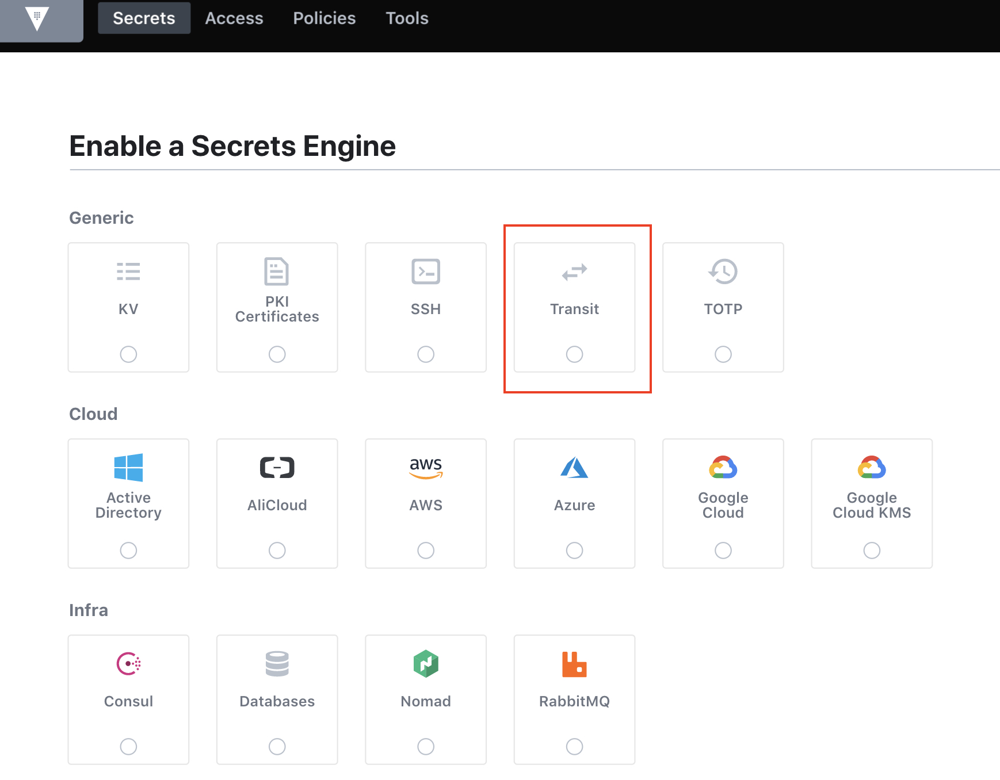
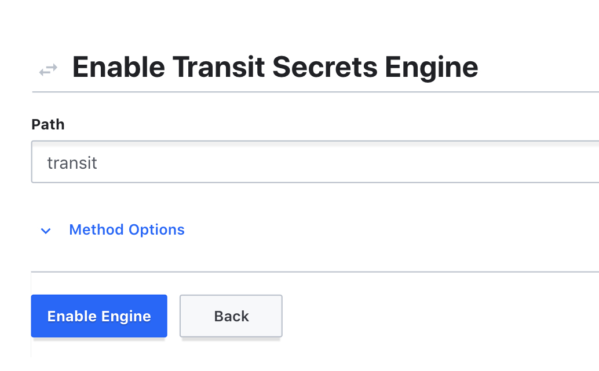
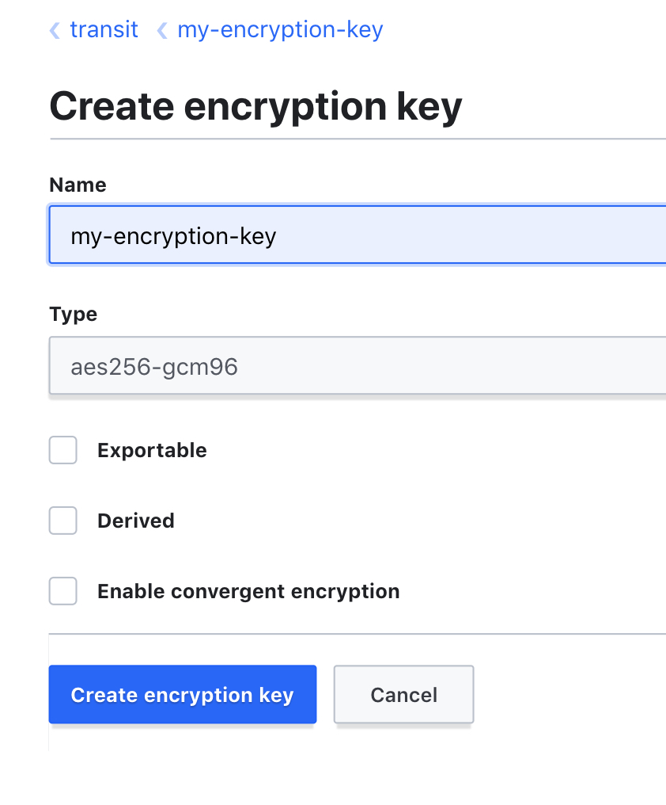
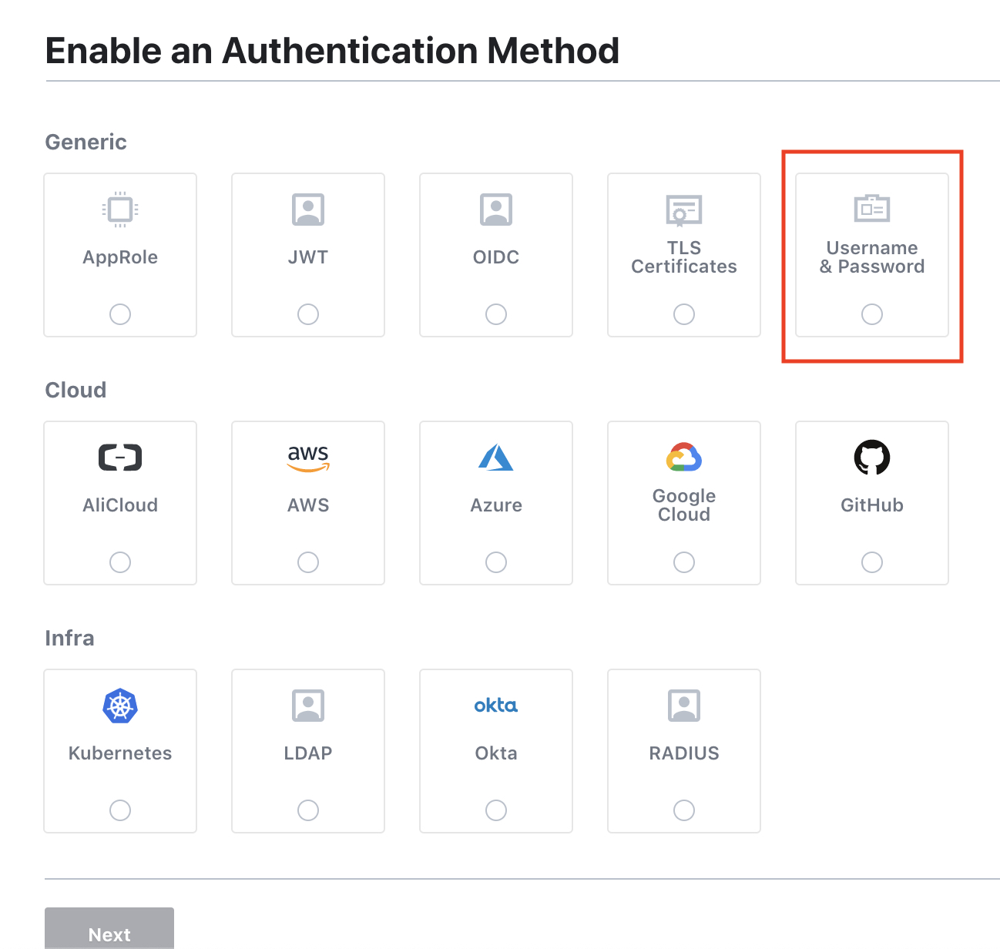
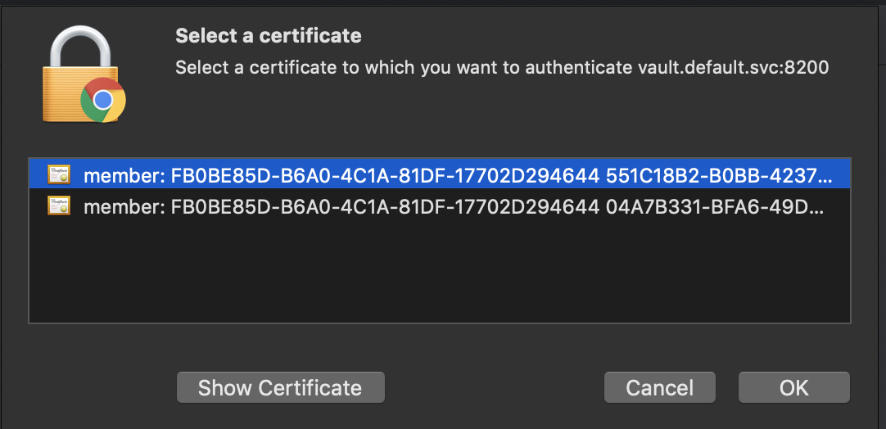

 

 

 

? **Which \*type\* of application would you like to create?** Microservice
application

? **[Beta] Do you want to make it reactive with Spring WebFlux?** No

? **What is the base name of your application?** Transaction

? **As you are running in a microservice architecture, on which port would like
yo**

**ur server to run? It should be unique to avoid port conflicts.** 8081

? **What is your default Java package name?** com.azrul.ebanking.transaction

? **Which service discovery server do you want to use?** JHipster Registry (uses
Eur

eka, provides Spring Cloud Config support and monitoring dashboards)

? **Which \*type\* of authentication would you like to use?** JWT authentication
(stat

eless, with a token)

? **Which \*type\* of database would you like to use?** SQL (H2, MySQL, MariaDB,
Postg

reSQL, Oracle, MSSQL)

? **Which \*production\* database would you like to use?** PostgreSQL

? **Which \*development\* database would you like to use?** H2 with disk-based
persist

ence

? **Do you want to use the Spring cache abstraction?** No - Warning, when using
an S

QL database, this will disable the Hibernate 2nd level cache!

? **Would you like to use Maven or Gradle for building the backend?** Maven

? **Which other technologies would you like to use?** 

? **Would you like to enable internationalization support?** No

? **Besides JUnit and Jest, which testing frameworks would you like to use?** 

? **Would you like to install other generators from the JHipster Marketplace?**
No

\--------------

? **Which \*type\* of application would you like to create?** Microservice
application

? **[Beta] Do you want to make it reactive with Spring WebFlux?** No

? **What is the base name of your application?** DepositAccount

? **As you are running in a microservice architecture, on which port would like
yo**

**ur server to run? It should be unique to avoid port conflicts.** 8082

? **What is your default Java package name?** com.azrul.ebanking.depositaccount

? **Which service discovery server do you want to use?** JHipster Registry (uses
Eur

eka, provides Spring Cloud Config support and monitoring dashboards)

? **Which \*type\* of authentication would you like to use?** JWT authentication
(stat

eless, with a token)

? **Which \*type\* of database would you like to use?** SQL (H2, MySQL, MariaDB,
Postg

reSQL, Oracle, MSSQL)

? **Which \*production\* database would you like to use?** PostgreSQL

? **Which \*development\* database would you like to use?** H2 with disk-based
persist

ence

? **Do you want to use the Spring cache abstraction?** No - Warning, when using
an S

QL database, this will disable the Hibernate 2nd level cache!

? **Would you like to use Maven or Gradle for building the backend?** Maven

? **Which other technologies would you like to use?** 

? **Would you like to enable internationalization support?** No

? **Besides JUnit and Jest, which testing frameworks would you like to use?** 

? **Would you like to install other generators from the JHipster Marketplace?**
(y/N

) No

\----------------

 

? **Which \*type\* of application would you like to create?** Microservice
gateway

? **[Beta] Do you want to make it reactive with Spring WebFlux?** No

? **What is the base name of your application?** GatewayKafka

? **As you are running in a microservice architecture, on which port would like
yo**

**ur server to run? It should be unique to avoid port conflicts.** 8080

? **What is your default Java package name?** com.azrul.ebanking.gatewaykafka

? **Which service discovery server do you want to use?** JHipster Registry (uses
Eur

eka, provides Spring Cloud Config support and monitoring dashboards)

? **Which \*type\* of authentication would you like to use?** JWT authentication
(stat

eless, with a token)

? **Which \*type\* of database would you like to use?** SQL (H2, MySQL, MariaDB,
Postg

reSQL, Oracle, MSSQL)

? **Which \*production\* database would you like to use?** PostgreSQL

? **Which \*development\* database would you like to use?** H2 with disk-based
persist

ence

? **Do you want to use the Spring cache abstraction?** No - Warning, when using
an S

QL database, this will disable the Hibernate 2nd level cache!

? **Do you want to use Hibernate 2nd level cache?** No

? **Would you like to use Maven or Gradle for building the backend?** Maven

? **Which other technologies would you like to use?** 

? **Which \*Framework\* would you like to use for the client?** Angular

? **Would you like to use a Bootswatch theme (https://bootswatch.com/)?**
Default JH

ipster

? **Would you like to enable internationalization support?** No

? **Besides JUnit and Jest, which testing frameworks would you like to use?** 

? **Would you like to install other generators from the JHipster Marketplace?**
(y/N

) No

 

 

Install Kafka
-------------

Azruls-MacBook-Pro:\~ azrul\$ helm repo add bitnami
https://charts.bitnami.com/bitnami

"bitnami" has been added to your repositories

Azruls-MacBook-Pro:\~ azrul\$ helm install my-kafka bitnami/kafka

NAME: my-kafka

LAST DEPLOYED: Mon Sep 14 09:08:13 2020

NAMESPACE: default

STATUS: deployed

REVISION: 1

TEST SUITE: None

NOTES:

\*\* Please be patient while the chart is being deployed \*\*

Kafka can be accessed by consumers via port 9092 on the following DNS name from
within your cluster:

    my-kafka.default.svc.cluster.local

Each Kafka broker can be accessed by producers via port 9092 on the following
DNS name(s) from within your cluster:

    my-kafka-0.my-kafka-headless.default.svc.cluster.local:9092

To create a pod that you can use as a Kafka client run the following commands:

    kubectl run my-kafka-client --restart='Never' --image
docker.io/bitnami/kafka:2.6.0-debian-10-r18 --namespace default --command --
sleep infinity

    kubectl exec --tty -i my-kafka-client --namespace default -- bash

    PRODUCER:

        kafka-console-producer.sh \\

            --broker-list
my-kafka-0.my-kafka-headless.default.svc.cluster.local:9092 \\

            --topic test

    CONSUMER:

        kafka-console-consumer.sh \\

            --bootstrap-server my-kafka.default.svc.cluster.local:9092 \\

            --topic test \\

            --from-beginning

 

 

 

Create topics
-------------

~~~~~~~~~~~~~~~~~~~~~~~~~~~~~~~~~~~~~~~~~~~~~~~~~~~~~~~~~~~~~~~~~~~~~~~~~~~~~~~~
bin/kafka-topics.sh --create --topic deposit-debit-request --bootstrap-server localhost:9092
~~~~~~~~~~~~~~~~~~~~~~~~~~~~~~~~~~~~~~~~~~~~~~~~~~~~~~~~~~~~~~~~~~~~~~~~~~~~~~~~

 

~~~~~~~~~~~~~~~~~~~~~~~~~~~~~~~~~~~~~~~~~~~~~~~~~~~~~~~~~~~~~~~~~~~~~~~~~~~~~~~~
bin/kafka-topics.sh --create --topic deposit-debit-response --bootstrap-server localhost:9092
~~~~~~~~~~~~~~~~~~~~~~~~~~~~~~~~~~~~~~~~~~~~~~~~~~~~~~~~~~~~~~~~~~~~~~~~~~~~~~~~

 

 

Build Docker Image
------------------

 

To generate the missing Docker image(s), please run:

  ./mvnw -ntp -Pprod -Dmaven.test.skip=true verify jib:dockerBuild in
/Users/azrul/Documents/GitHub/Ebanking-JHipster-Kafka-Vault/DepositAccount

  ./mvnw -ntp -Pprod -Dmaven.test.skip=true verify jib:dockerBuild in
/Users/azrul/Documents/GitHub/Ebanking-JHipster-Kafka-Vault/Gateway

  ./mvnw -ntp -Pprod -Dmaven.test.skip=true verify jib:dockerBuild in
/Users/azrul/Documents/GitHub/Ebanking-JHipster-Kafka-Vault/Transaction

 

 

**INFO!** Alternatively, you can use Jib to build and push image directly to a
remote registry:

  ./mvnw -ntp -Pprod -Dmaven.test.skip=true verify jib:build
-Djib.to.image=azrulhasni/depositaccount in
/Users/azrul/Documents/GitHub/Ebanking-JHipster-Kafka-Vault/DepositAccount

  ./mvnw -ntp -Pprod -Dmaven.test.skip=true verify jib:build
-Djib.to.image=azrulhasni/gateway_kafka in
/Users/azrul/Documents/GitHub/Ebanking-JHipster-Kafka-Vault/gateway_kafka

  ./mvnw -ntp -Pprod -Dmaven.test.skip=true verify jib:build
-Djib.to.image=azrulhasni/transaction in
/Users/azrul/Documents/GitHub/Ebanking-JHipster-Kafka-Vault/Transaction

You can deploy all your apps by running the following kubectl command:

  bash kubectl-apply.sh -f

 

Test
----

 

### Authenticate

curl -X POST "http://localhost:8080/api/authenticate" -H "accept: \*/\*" -H
"Content-Type: application/json" -H "Authorization: Bearer " -d "{
\\"password\\": \\"admin\\", \\"rememberMe\\": true, \\"username\\":
\\"admin\\"}"

 

 

Vault
-----

###  Install with TLS

=====

SERVICE=vault

 

\# NAMESPACE where the Vault service is running.

NAMESPACE=default

 

\# SECRET_NAME to create in the Kubernetes secrets store.

SECRET_NAME=vault-server-tls

 

\# TMPDIR is a temporary working directory.

TMPDIR=/tmp

=====

openssl genrsa -out \${TMPDIR}/vault.key 2048

=====

cat \<\<EOF \>\${TMPDIR}/csr.conf

[req]

req_extensions = v3_req

distinguished_name = req_distinguished_name

[req_distinguished_name]

[ v3_req ]

basicConstraints = CA:FALSE

keyUsage = nonRepudiation, digitalSignature, keyEncipherment

extendedKeyUsage = serverAuth

subjectAltName = \@alt_names

[alt_names]

DNS.1 = \${SERVICE}

DNS.2 = \${SERVICE}.\${NAMESPACE}

DNS.3 = \${SERVICE}.\${NAMESPACE}.svc

DNS.4 = \${SERVICE}.\${NAMESPACE}.svc.cluster.local

IP.1 = 127.0.0.1

EOF

=========

openssl req -new -key \${TMPDIR}/vault.key -subj
"/CN=\${SERVICE}.\${NAMESPACE}.svc" -out \${TMPDIR}/server.csr -config
\${TMPDIR}/csr.conf

========

export CSR_NAME=vault-csr

cat \<\<EOF \>\${TMPDIR}/csr.yaml

apiVersion: certificates.k8s.io/v1beta1

kind: CertificateSigningRequest

metadata:

name: \${CSR_NAME}

spec:

groups:

- system:authenticated

request: \$(cat \${TMPDIR}/server.csr \| base64 \| tr -d '\\n')

usages:

- digital signature

- key encipherment

- server auth

EOF

=====

kubectl create -f \${TMPDIR}/csr.yaml

=====

serverCert=\$(kubectl get csr \${CSR_NAME} -o jsonpath='{.status.certificate}')

=====

echo "\${serverCert}" \| openssl base64 -d -A -out \${TMPDIR}/vault.crt

 

 

### Test

curl --header "X-Vault-Token: s.6HAohs85JhXqRlA2aHqLZPpx” --request POST --data
'{"plaintext":
"Sm9uLFNub3csNDExMSAxMTExIDExMTEgMTExMSxyZXN0YXVyYW50LCwxODkyMDMwOTAzCg=="}'
https://127.0.0.1:8200/v1/transit/encrypt/my-encryption-key

 

curl --header "X-Vault-Token: s.6HAohs85JhXqRlA2aHqLZPpx" --request POST --data
'{"plaintext":
"Sm9uLFNub3csNDExMSAxMTExIDExMTEgMTExMSxyZXN0YXVyYW50LCwxODkyMDMwOTAzCg=="}' -k
https://127.0.0.1:8200/v1/transit/encrypt/my-encryption-key

 

curl --header "X-Vault-Token: s.HaQbS7GfuGmWgmgXeFNmZuJr" --request POST --data
'{"ciphertext":"vault:v1:R2R4Ws0YRo0BHA+eZl0iYXuzipyYDgYM0DrsTyU9OsdWpUWQH0LZP25zHfST+4n6B7J/ADVLp606HAKyWbFOZyXEkRr5DHFXDY/Nv1+i0tQ="}'
--insecure https://127.0.0.1:8200/v1/transit/decrypt/my-encryption-key

 

### Install Vault’s cert into keystone

sudo keytool -import -file "/tmp/vault.crt" -keystore
"/Library/Java/JavaVirtualMachines/jdk-14.0.2.jdk/Contents/Home/lib/security/cacerts"
-alias "vault certificate"

Password: changeit

 

### Unseal

Initiatialive

\> kubectl exec -ti vault-0 -- vault operator init

 

 

Unseal Key 1: vdV...3E8

Unseal Key 2: fjG...AG8

Unseal Key 3: zLm...bsP

Unseal Key 4: Pwt...Yw3

Unseal Key 5: orT...PC7

 

Initial Root Token: s.W...Peq

 

Vault initialized with 5 key shares and a key threshold of 3. Please securely

distribute the key shares printed above. When the Vault is re-sealed,

restarted, or stopped, you must supply at least 3 of these keys to unseal it

before it can start servicing requests.

Vault does not store the generated master key. Without at least 3 key to

reconstruct the master key, Vault will remain permanently sealed!

It is possible to generate new unseal keys, provided you have a quorum of

existing unseal keys shares. See "vault operator rekey" for more information.

 

Unseal

 

\> kubectl exec -ti vault-0 -- vault operator unseal \<— Will prompt. Put in 3
out of 5 keys above

 

Key             Value

\---             -----

Seal Type       shamir

Initialized     true

Sealed          **false**

Total Shares    5

Threshold       3

Version         1.5.2

Cluster Name    vault-cluster-f18e6fcf

Cluster ID      c3cf711c-f2bf-75e8-b115-528741d63499

HA Enabled      false

 

Web interface

\> kubectl port-forward vault-0 8200:8200

 

 

 

~~~~~~~~~~~~~~~~~~~~~~~~~~~~~~~~~~~~~~~~~~~~~~~~~~~~~~~~~~~~~~~~~~~~~~~~~~~~~~~~
path "transit/encrypt/my-encryption" {
  capabilities = [ "update" ]
}

path "transit/decrypt/my-encryption" {
  capabilities = [ "update" ]
}
~~~~~~~~~~~~~~~~~~~~~~~~~~~~~~~~~~~~~~~~~~~~~~~~~~~~~~~~~~~~~~~~~~~~~~~~~~~~~~~~

curl --header "X-Vault-Token: s.Wc167JHLx2QGMNJUY4JAePeq" --request POST --data
'{"plaintext":
"Sm9uLFNub3csNDExMSAxMTExIDExMTEgMTExMSxyZXN0YXVyYW50LCwxODkyMDMwOTAzCg=="}'
--insecure https://127.0.0.1:8200/v1/transit/encrypt/my-encryption-key

 

{"request_id":"cd97f1fa-1254-ff51-5eac-022d1c30a1d7","lease_id":"","renewable":false,"lease_duration":0,"data":{"ciphertext":"vault:v1:bryhqHJ6yV43qVX95RiUsBuFDJ13Wdn7+td3tA3OMfFTt2i0eH/341tFzmWWrGgAQBLZxOWsB00nRT9wKmuzZ4e1FGO39Blhu3FWwb6oIfU=","key_version":1},"wrap_info":null,"warnings":null,"auth":null}

 

 

curl --header "X-Vault-Token: s.Wc167JHLx2QGMNJUY4JAePeq" --request POST --data
'{"ciphertext":"vault:v1:bryhqHJ6yV43qVX95RiUsBuFDJ13Wdn7+td3tA3OMfFTt2i0eH/341tFzmWWrGgAQBLZxOWsB00nRT9wKmuzZ4e1FGO39Blhu3FWwb6oIfU=“}’
https://127.0.0.1:8200/v1/transit/decrypt/my-encryption-key

 

{

"request_id":"0c404a2c-fb6f-c239-b98a-4004480ae764",

"lease_id":"",

"renewable":false,

"lease_duration":0,

"data":{

"plaintext":"Sm9uLFNub3csNDExMSAxMTExIDExMTEgMTExMSxyZXN0YXVyYW50LCwxODkyMDMwOTAzCg=="

},

"wrap_info":null,

"warnings":null,

}

 

 

 
-

 
